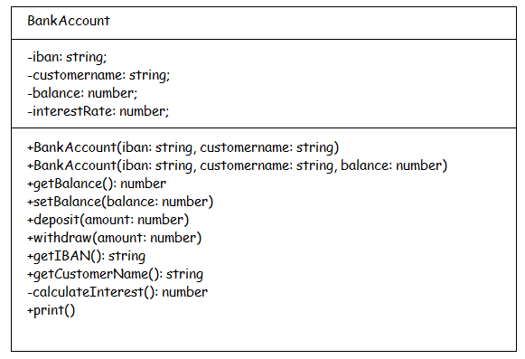

# Angular Exercise 1 – TypeScript

> Complete ALL the exercises in this section. Ask thomas.devine@atu.ie for help.

## Contents

- [Install TypeScript](#part-1---install-typescript)
- [Hello World](#part-2---hello-world)
- [Types](#part-3---types)
- [Function Expressions & Arrow Functions](#part-4---function-expressions--arrow-functions)
- Classes & Objects
- Constructors
- Access Modifiers
- Modules

## Part 1 - Install TypeScript

```
$ npm install -g typescript
$
$ tsc --version
Version x.y.z
$
```

## Part 2 - Hello World

Use an editor like [Visual Studio Code](https://code.visualstudio.com/) to type your code.  Create a folder called `test` for your code.

1.  Create `helloworld.ts`:

    ```typescript
    console.log("hello, world!");

    ```

1.  Compile and execute `helloworld.ts`:

    ```
    $ tsc helloworld.ts
    $ dir or ls
    $ node helloworld.js
    hello, world!
    $

    ```


## Part 3 - Types

1.	Create and examine this JavaScript code in `types.ts`:

	```javascript
	var firstname;
	var found;
	var age;
	var lotto = [1,2,3,4,5,6];
	let names = ["Alice","Bob","Charlie"];

	firstname="Tom";
	found=true;
	age=21;

	console.log(firstname);
	console.log(found);
	console.log(age);
	for(var i=0;i<lotto.length;i++)
		console.log(lotto[i]);
	for(var i=0;i<names.length;i++)
		console.log(names[i]);

	```

	It prints this when executed:

	```
	Tom
	true
	21
	1
	2
	3
	4
	5
	6
	Alice
	Bob
	Charlie

	```

1.	You should use `let` instead of `var` whenever possible. Modify the code above to use the `let` keyword instead of `var`.  Also add the appropriate TypeScript type (`string`, `number`, etc. ) for each data variable.  Execute the TypeScript solution and get the same output.

1.	Create and examine this code is `funcs.ts`: 

	```typescript
	function add(...)
	{
		...
	}

	function max(...)
	{
		...
		...
		...
	}

	console.log(add(1,2));
	console.log(max([1,2,3,4,5,6]));

	```

	Add the code for two functions - `add()` and `max()` that add 1+2 and get the maximum number of the given array.  Again, use the `let` keyword and appropriate *data types* in your solution.

	The program should output:

	```
	3
	6
	
	```

## Part 4 - Function Expressions & Arrow Functions

1.	Create, examine and execute this code is `arrow.ts`:

	```typescript
	function factorial(value: number){
		let answer: number = 1;
		for(let i=value;i>0;i--)
		{
			answer=answer*i;
		}
		return answer;
	}

	console.log(factorial(4));

	```

1.	Convert *function declaration* above to a *function expression*.  Execute and get the same output.

1.	Convert *function expression* above to an *arrow function*.  Execute and get the same output.

1.	Convert the functions in `funcs.ts` to *arrow functions* too.  Execute and get the same output.

## Part 5 - Classes, Objects, etc.

1.  Examine the class diagram below for the class BankAccount.  The code needed for most methods should be obvious.  
    The interest rate is set to 0.10 in the constructor and ``calculateInterest()`` is a private method.

    

    In a file called `bankaccount.ts` add the TypeScript code to implement this class.

1.  To test your code for the `BankAccount` class, add the following tester code at the end of your program file (outside the class).

    ```typescript
    let joeAccount = new BankAccount('IE64BOFI90583812345678','Joe Bloggs',1000);
    console.log(`IBAN = ${joeAccount.getIBAN()}`);
    console.log(`customername = ${joeAccount.getCustomerName()}`);
    console.log(`balance = ${joeAccount.getBalance()}`);

    joeAccount.setBalance(2000);
    console.log(`balance = ${joeAccount.getBalance()}`);
    joeAccount.deposit(1000);
    console.log(`balance = ${joeAccount.getBalance()}`);
    joeAccount.withdraw(2000);
    console.log(`balance = ${joeAccount.getBalance()}`);
    console.log(`interst earned = ${joeAccount.calculateInterest()}`);                   // should cause a access error (comment out this line)
	console.log(`balance(+interest) = ${joeAccount.getBalancePlusInterest()}`);
	console.log(joeAccount.print());

    ```

    You should get this output:

    ```
    IBAN = IE64BOFI90583812345678
    customername = Joe Bloggs
    balance = 1000
    balance = 2000
    balance = 3000
    balance = 1000
    balance(+interest) = 1100
    BankAccount[iban=IE64BOFI90583812345678];customer name=Joe Bloggs;balance=1000]

    ```

1.  If you've implemented the constructor properly the following tester code should also work:

    ```typescript
    let maryAccount = new BankAccount('IE64BOFI90583887654321','Mary Bloggs');
    console.log(`balance = ${maryAccount.getBalance()}`);

    ```

    and the output should be:

    ```
    balance = 0

    ```

1.  Finally, let's make `bankaccount.ts` a TypeScript module.

    -   export the `BankAccount` class using the `export` command
    -   create a new file called `batester.ts` that imports the `BankAccount` class
    -   remove the tester code from the end of `bankaccount.ts` & move it into `batester.ts`
    -   execute `batester.ts` code and you should see output like before