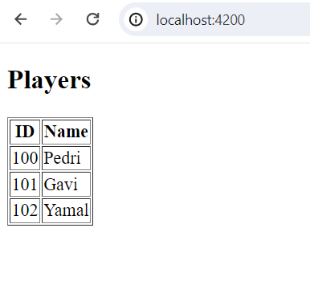
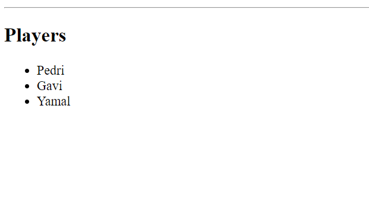
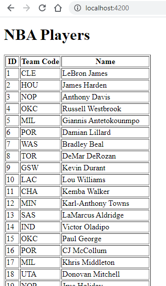

# Angular Exercise 3 – Components, Interfaces & Services

> Complete ALL the exercises in this section. Ask thomas.devine@atu.ie for help.

<!-- ## Contents -->


## Part 1 - Creating a Component 

1.  View the video **Create a Component** and create the `PlayersComponent` as shown.  Use the following HTML in the template `players.component.html`

    ```html
    <h2>Players</h2>
    <ul>
        <li>Pedri</li>
        <li>Gavi</li>
        <li>Yamal</li>
    </ul>
    ```

View the component at [http://localhost:4200](http://localhost:4200)


## Part 2 - @for 

1.  In the `PlayersComponent` create a `players` array:

    ```typescript
    players = [
        {id: 100, name: "Pedri"}, 
        {id: 101, name: "Gavi"}, 
        {id: 102, name: "Yamal"}  
    ];

    ```

    and modify the template `players.component.html` to render these players using interpolation and the `@for` command.  Display the players using `<li>` elements.

1.  Modify the code above to display the player names within a number ordered list (`<ol>`).

1.  Finally, modify the `PlayersComponent` to render this table:

    


## Part 3 - Player Interface

1.  View the video **Interfaces**.  Create and use the `Player` interface as shown. 


## Part 4 - Services with Dependency Injection

1.  View the video **Services**. Then create a service called `PlayersService` that has the `getPlayers()` method return the following player array:
    
    ```typescript
    players : Player[] = [
        {id: 100, name: "Pedri"}, 
        {id: 101, name: "Gavi"}, 
        {id: 102, name: "Yamal"}  
    ];

    ```

    Your solution should then render:

    
    

## Part 5 - NBAPlayers Component 

1.  Create a new Component `NbaPlayersComponent` that will render the output shown below:

    

    from the JSON content in [this](assets/NBAPlayers.json) JSON file.

    Create and use a service `NbaPlayersService` to provide the player data needed by the component.

    
