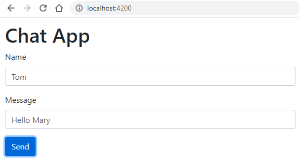
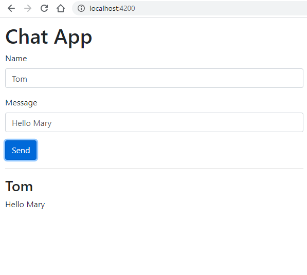
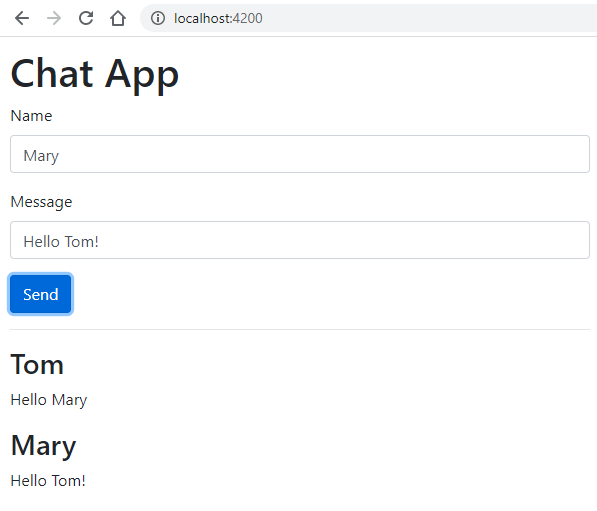

# Angular Exercise 5 – Forms

> Complete ALL the exercises in this section. Ask thomas.devine@atu.ie for help.

<!-- ## Contents -->

## Part 1 - ChatApp 

You are to create a simple messaging component.

1.  Create a new component called `ChatApp` that when rendered looks like this form:

    

    Your solution should use Bootstrap [[1](https://getbootstrap.com/),[2](https://www.w3schools.com/bootstrap4/)] and be implemented as a HTML form with a *Send* submit button.

1.  When you type a message and click *Send* the message content should be displayed beneath the form like this:

    

1.  When you type additional messages and click *Send* the message content should be added like this:

    

